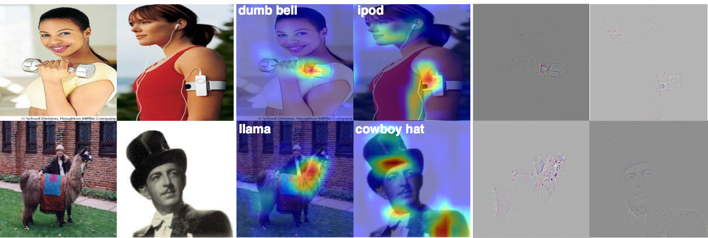

# Gradient-weighted Class Activation Mapping (Grad-CAM)

- TensorFlow implementation of [Grad-CAM: Visual Explanations from Deep Networks via Gradient-based Localization](https://arxiv.org/abs/1610.02391) (ICCV'17).
- Torch implementation by the authors is [here](https://github.com/ramprs/grad-cam).
- Grad-CAM generates similar heatmap as [CAM](https://arxiv.org/abs/1512.04150), but it does not require re-train the model.
- This implementation takes [VGG19](https://arxiv.org/abs/1409.1556) as example. 

## Requirements
- Python 3.3+
- [Tensorflow 1.3](https://www.tensorflow.org/)
- [TensorCV](https://github.com/conan7882/DeepVision-tensorflow) 

## Implementation Details

<!--- For MNIST dataset, a CNN with three convolutional layers followed by a global average pooling layer is used.-->

- [VGG19](https://arxiv.org/abs/1409.1556) is used for visualization. The model is defined in [CNN-Visualization/common/models/VGG.py](../common/models/VGG.py).
- Grad-CAM model is defined in [gradCAM.py](gradCAM.py).
- Main function is in [CNN-Visualization/gradcam.py](../gradcam.py).

## Results

Left to right: Original Image, Grad-CAM, Guided Grad-CAM, Grad-CAM, Guided Grad-CAM


Compare with CAM using the same images (Caltech-256) (CAM result can be found [here](https://github.com/conan7882/CNN-Visualization/tree/master/class_activation_map#caltech-256)):
**ImageNet1000 does not have class 'top hat', so class 'cowboy hat' is used here which gets relatively bad performance to find the hat. Also note that, the pre-trained VGG19 is not trained on Caltech-256.**




<!--## Observations-->

## Preparation

1. Setup directories in file *CNN-Visualization/guidedbackpro.py*. 
  
    - *`IM_PATH`* - directory of testing image data
    - *`VGG_PATH`* - directory of pre-trained VGG19 parameters
    - *`SAVE_DIR`* - directory of saving result images
   
2. Download the pre-trained VGG parameters
       
    - Download pre-trained VGG19 model [here](https://github.com/machrisaa/tensorflow-vgg#tensorflow-vgg16-and-vgg19) and put it in *`VGG_PATH`*.
         
       
3. Testing images
 
    - Put testing images in *`IM_PATH`* .
    - Set class labels on line 48 in *CNN-Visualization/gradcam.py*. For example the setting below will generate Grad-CAM and Guided Grad-CAM for class 55 (llama), 543 (dumbbell), 605 (iPod) and 515 (hat). More labels for ImageNet1000 can be found [here](https://github.com/conan7882/VGG-tensorflow/blob/master/imageNetLabel.txt).
    
      ```
      class_id = [355, 543, 605, 515]
      ```
    
    - Change image type to the corresponding type in the function below (line 73 in *CNN-Visualization/gradcam.py*) if testing images are not jpeg files.
    
      ```
      input_im = ImageFromFile('.jpg', data_dir=IM_PATH, num_channel=3, shuffle=False)
      ```
       

## Run Script:

To get the Grad-CAM maps for all the image in *`IM_PATH`*, just run:

```
python gradcam.py
```	

- All the test images will be rescaled to smallest side = 224 before feed into VGG19.
- Grad-CAM and Guided Grad-CAM will be saved in *`SAVE_DIR`* as **gradcam_IDX_class_CLASSLABEL.png** and **guided_gradcam_IDX_class_CLASSLABEL.png** 


## Author
Qian Ge


	
	


 
